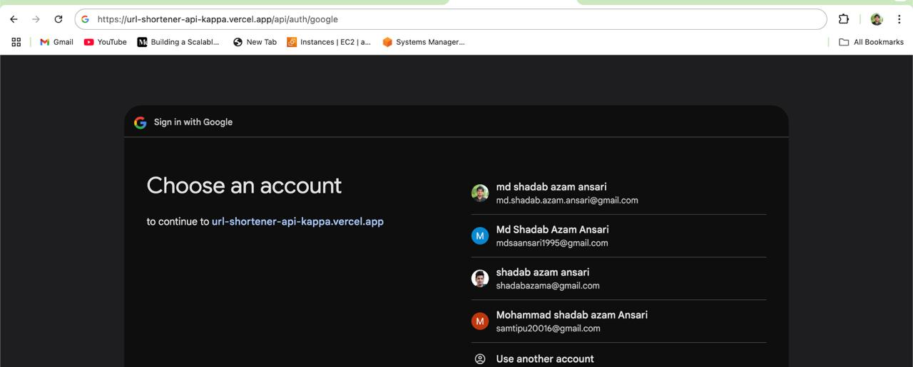
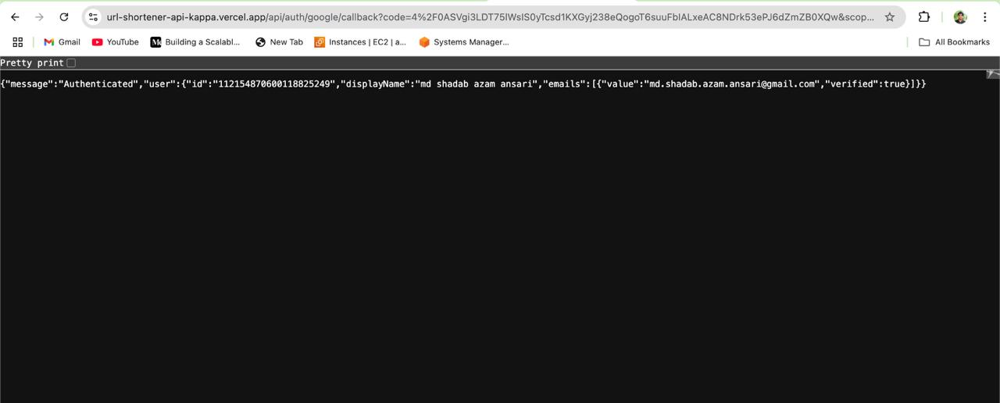
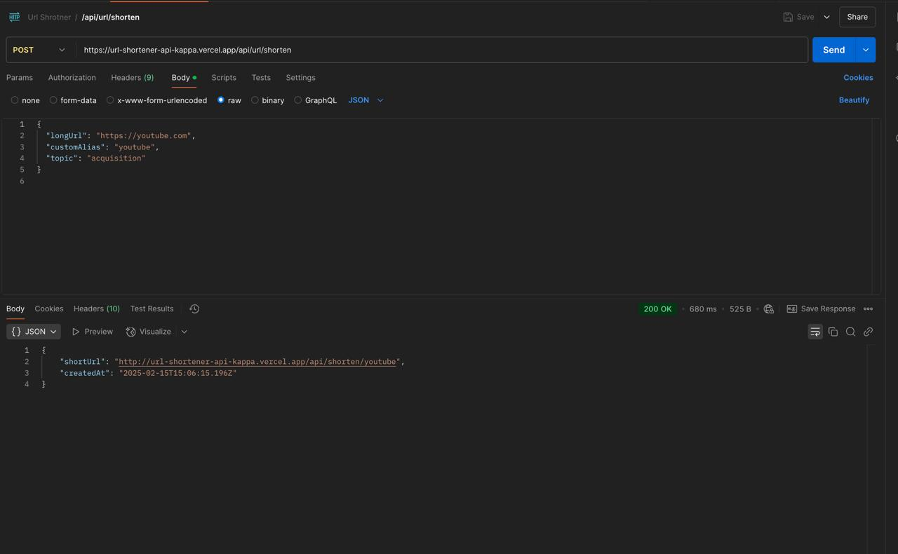
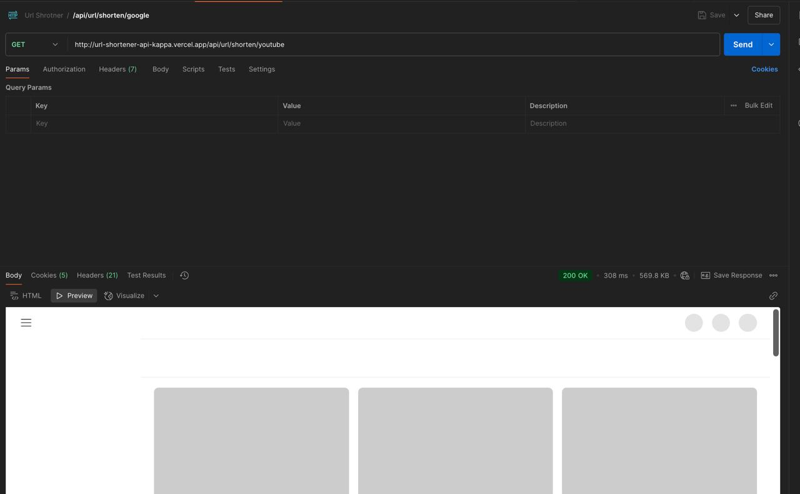
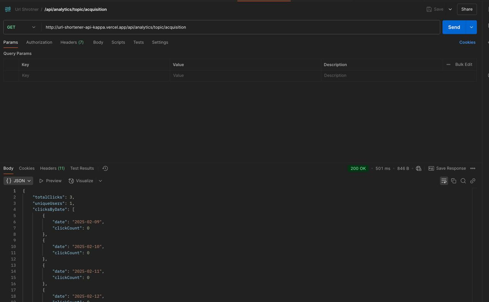
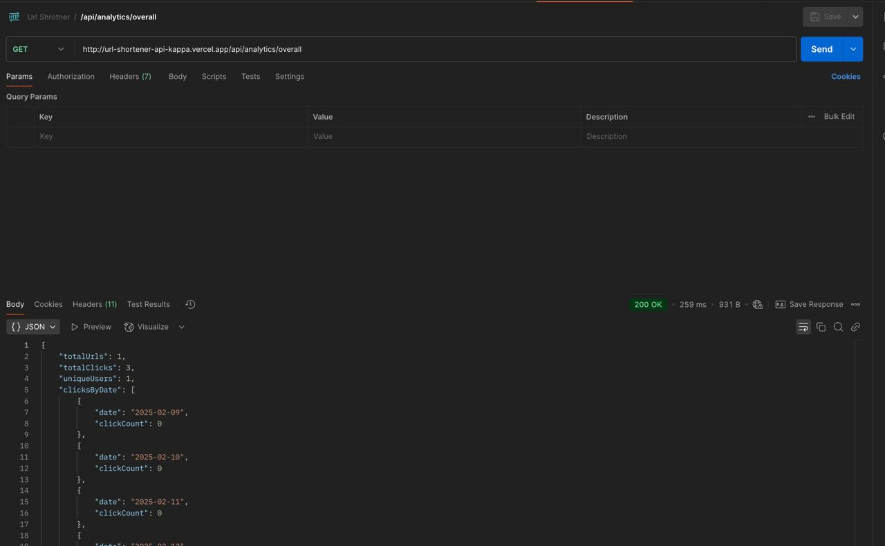

# url-shortener-api

# url-shortener-api

BASE URL: https://url-shortener-api-kappa.vercel.app/

# Testing Documentation

This folder contains screenshots (JPEG images) that document key features of the URL Shortener API. All images are stored in the **testing** folder.

## Screenshots

### Google Oauth API
https://url-shortener-api-kappa.vercel.app/api/auth/google

### Google Oauth callback API

### Shorten URL API
https://url-shortener-api-kappa.vercel.app/api/url/shorten

### Short URL Access API
http://url-shortener-api-kappa.vercel.app/api/url/shorten/youtube

### Analytic API
http://url-shortener-api-kappa.vercel.app/api/analytics/youtube

### Topics API
http://url-shortener-api-kappa.vercel.app/api/analytics/topic/acquisition

### Overall API
http://url-shortener-api-kappa.vercel.app/api/analytics/overall

Google Oauth API is not working with postman, only working in google chrome.